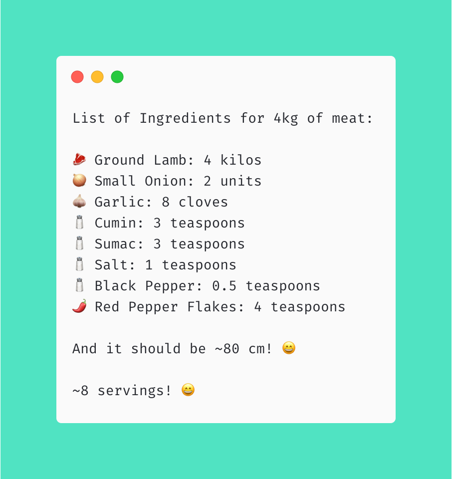

# Seasons of Serverless - Week 3

This repository is my solution for the Seasons of Serverless Week 3 Challenge: "The Longest Kebab" 🧑‍🍳 🍢



## About the solution

This is an Azure function that, given an amount of ground lamb (meatAmount param), returns:

* The quantity of ingredientes to maximize the recipe
* The length of the resulting kebab
* Number of people who can enjoy this meal

## Considerations

* The calculations are based on this [recipe](https://www.thespruceeats.com/adana-kebab-4164647) 
* I assumed a serving with a length of 10 cm (including all ingredients) and consistent distribution of ingredients... Which means that a 10cm-long kebab would be enough to feed 4 people (or 1 Jose tbh 😅)

## How to run this
* .NET 3 installed
* C# extension for VSCode (OmniSharp)
* Azure Functions Extension for VSCode 
* Open the project and press F5 or run 
  ```  func host start   ``` in the terminal
* Go to the browser and open ```http://localhost:7071/api/KebabExample?meatAmount=2```


Happy cooking!